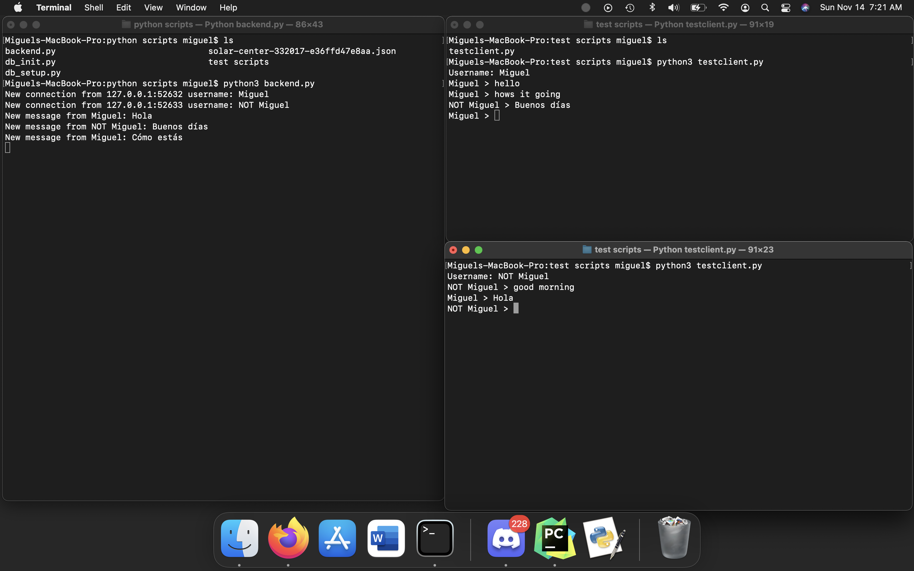
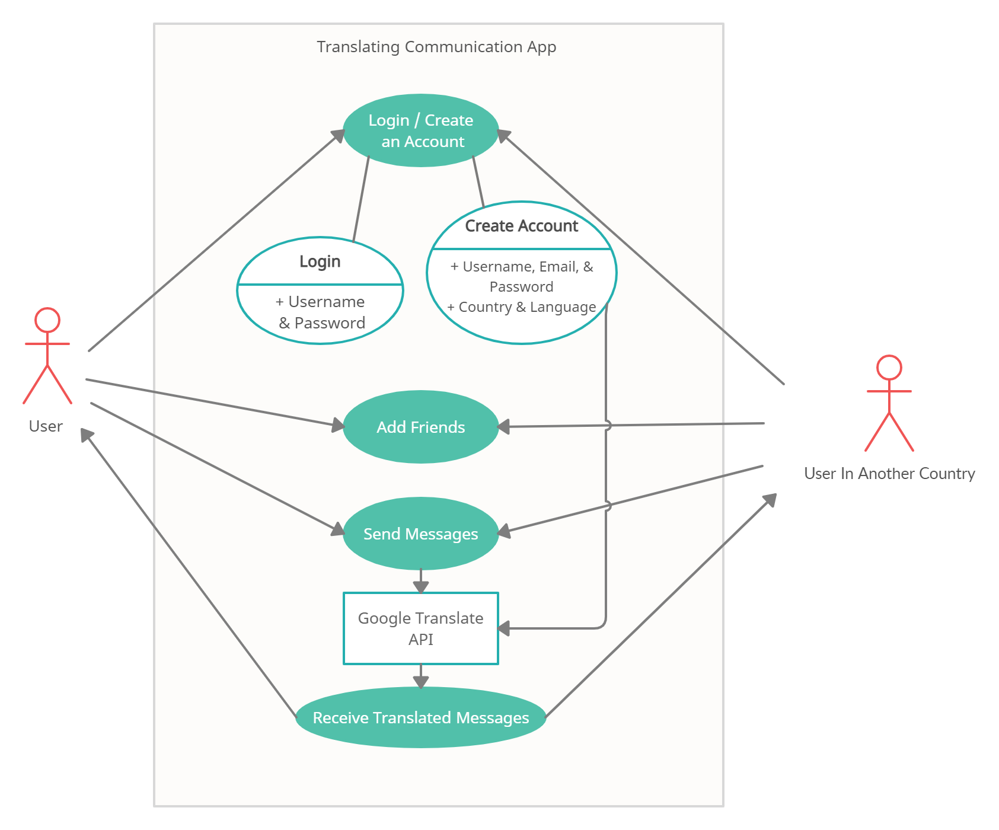
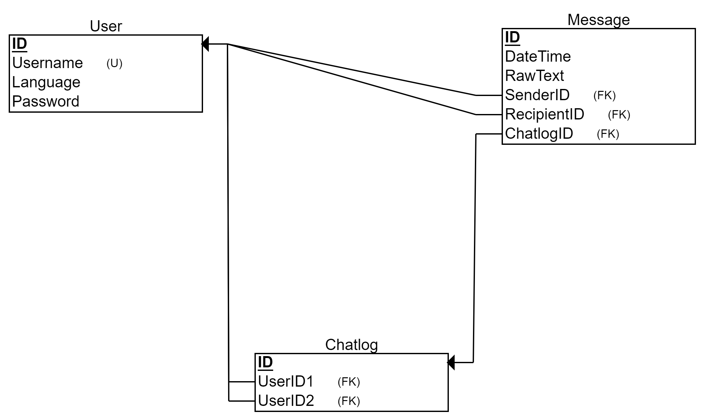
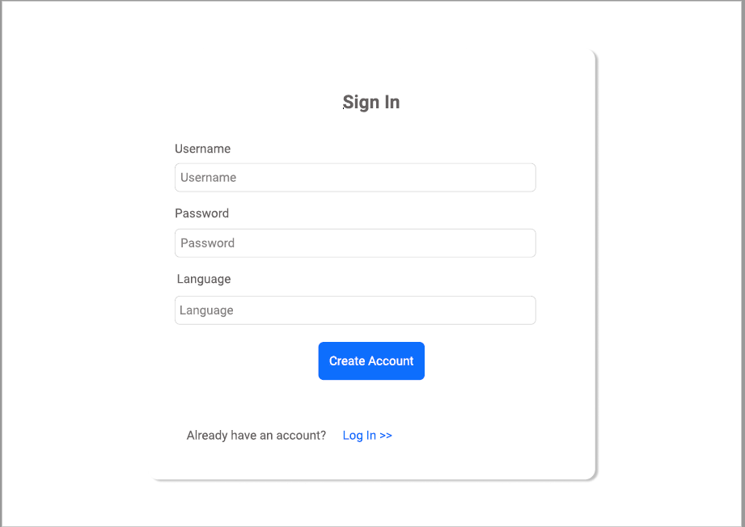
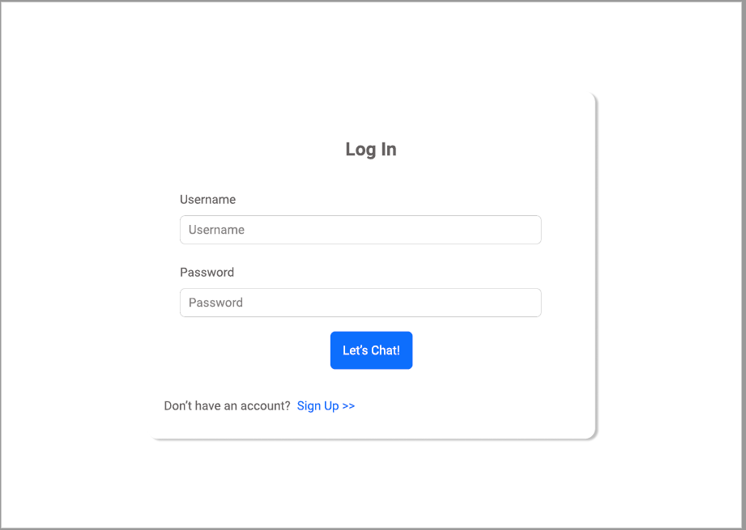
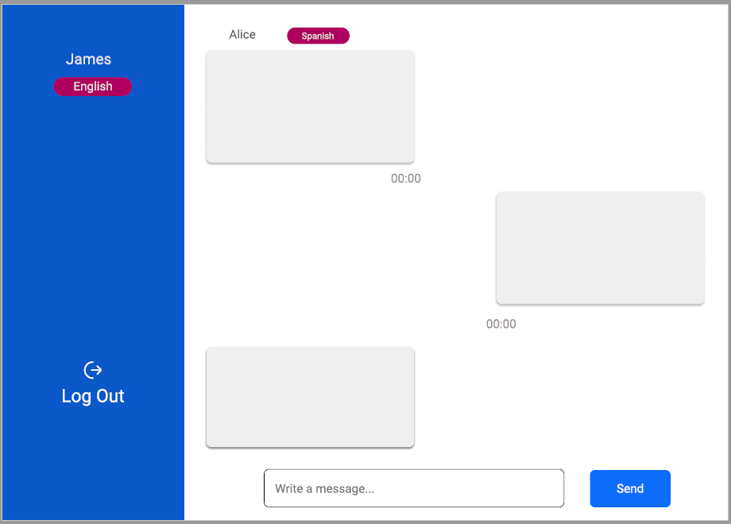

# SpeaknMe

**Date:** 11/12/2021 9PM - 11/14/2021 9AM
**Event:** Knight Hack 2021
**Project Name:** SpeaknMe
**Members:** Chisa, Miguel, John, Ashley

## Tools Used

**Front end:** HTML / CSS / BootStrap framework / JavaScript
**Back end:** Python
**Database:** Google Cloud / SQL
**API:** Google Translation API

## About the Project

_This is an web application which users can chat with people from all around the world. This SpeaknMe has a real-time translation functionality, so the users who use different languages can communicate with each other without issues._

## Documentations

### Translation Chat Functionality (Backend)

The two command lines 'Miguel' and 'NOT Miguel' can chat each other.
'Miguel' messages in _English_ then translates into _Spanish_.
'NOT Miguel' messages in _Spanish_ the translates into _English_.

### Diagrams

Use Case Diagram

ER Diagram

### Prototypes

Sign In Page

Log In Page

Chat Page

